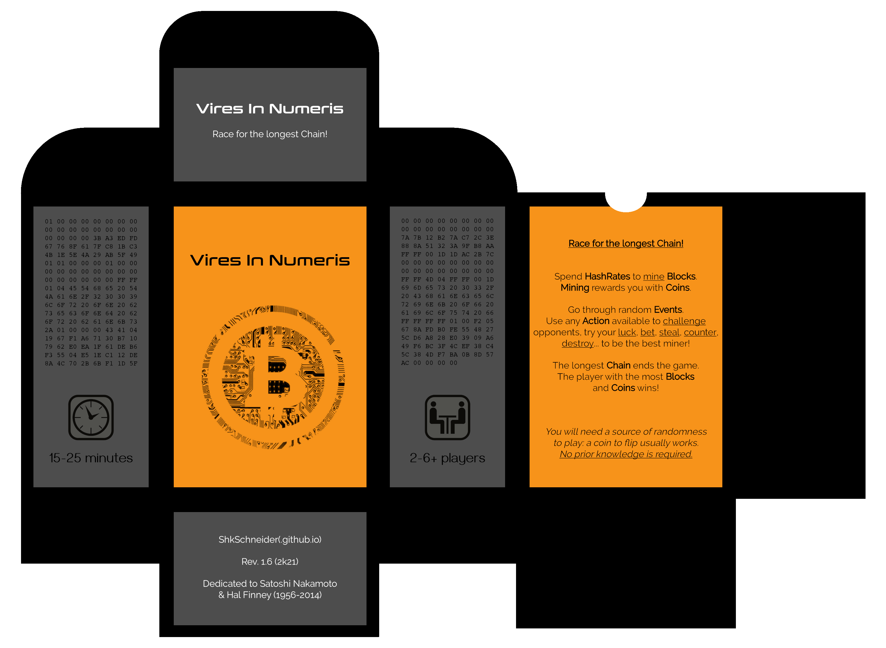

Vires In Numeris 
================

> Race for the longest Chain!

Abstract
--------

This card game has obvious inspirations from Bitcoin and its miners' race in the network.
Any prior knowledge is not required. Moreover, cards got information that might learn you a thing or two.
Each players act like a Node, competing to mine Blocks faster than the others using HashRates (computational power).
Blocks cost increasingly more HashRates to mine but always rewards a single Coin.
The longest Chain of Blocks will end the game. The player with the most Blocks and Coins wins.

[cards.json](cards.json)

Credits
-------

- Concept
  - ShkSchneider(.github.io)
- Design
  - ShkSchneider
  - CryptoIcons(.co)
  - Fonts: Conthrax, Raleway, Gayathri
- Texts
  - ShkSchneider
  - Alexandria: CoinMarketCap(.com)
- Testing
  - ShkSchneider
  - MeJe

Rev. 1.6 (2k21)

Licensed under [CC-BY-SA 4.0](https://creativecommons.org/licenses/by-sa/4.0)
